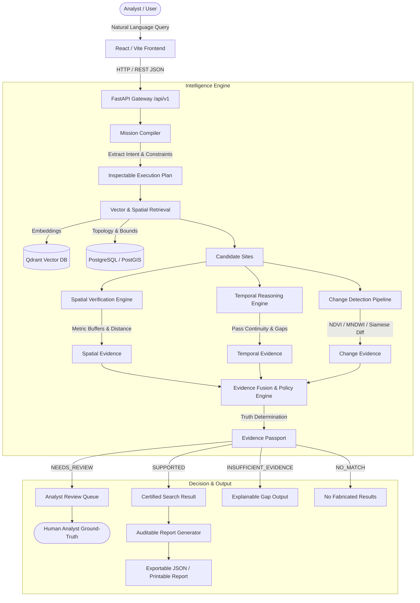

# TerraSeek Architecture & System Design

TerraSeek is an evidence-first satellite intelligence platform designed to enable natural language search, semantic vector retrieval, multi-temporal observation verification, and automated change delineation without fabricated AI confidence scores.

## Architecture Diagram

## System Layers

### 1. User Interface Layer (`apps/web`)
- **React 18 + Vite + Tailwind CSS**: Clean, analytical, public-service style. No distracting neon colors, glassmorphism, or fake percentages.
- **MapLibre GL JS**: Offline-first map rendering with local coordinate grid relief, dynamic vector markers, and change footprint delineation.
- **Before/After Viewer**: Synchronized side-by-side passes and swipe slider comparison.

### 2. API Gateway Layer (`apps/api`)
- **FastAPI**: Fully asynchronous typed endpoints under `/api/v1`.
- **Request Tracking**: Automatic `X-Request-ID` and latency calculation.
- **Error Standardization**: Consistent structured JSON error contracts across validation, database, and model failures.

### 3. Discovery & Mission Compiler (`terraseek.discovery`)
- Translates analyst natural language queries into machine-verifiable mission intents.
- Extracts target entities (building, road, vegetation, water), spatial constraints (e.g. `within 500m of river`), and temporal observation requirements.

### 4. Storage & Spatial Engine (`terraseek.spatial` & `terraseek.storage`)
- **PostGIS & Shapely**: Geodesic metric projections (EPSG:4326 to EPSG:3857) to measure distance to physical landmarks (rivers, roads, coastlines).
- **Filesystem / S3 Abstraction**: Decoupled asset storage for optical multispectral rasters and thumbnails.

### 5. Temporal Reasoning Engine (`terraseek.temporal`)
- Determines baseline availability, observation continuity, and identifies the **Earliest Supported Observation**.
- Prevents false negatives when historical imagery is missing.

### 6. Change Detection & Spectral Engine (`terraseek.change` & `terraseek.raster`)
- **Structural Models**: Siamese U-Net ResNet-34 adapter for building/road footprints.
- **Spectral Indices**: NDVI (Normalized Difference Vegetation Index) for canopy loss and MNDWI (Modified Normalized Difference Water Index) for water body contraction.
- **Local Demo Adapters**: Algorithmic differences and thresholding clearly tagged as `ModelTier.DEMO`.

### 7. Evidence Engine & Truth Policy (`terraseek.evidence`)
- Generates immutable **Evidence Passports** with itemized provenance (source, method, timestamp, geometry).
- Strictly classifies determinations into:
  - `SUPPORTED`: All spatial, temporal, and change criteria proven.
  - `NEEDS_REVIEW`: Borderline criteria escalated to human queue.
  - `INSUFFICIENT_EVIDENCE`: Missing baseline observations explicitly reported.
  - `NO_MATCH`: Target not present; never fabricates false entities.
